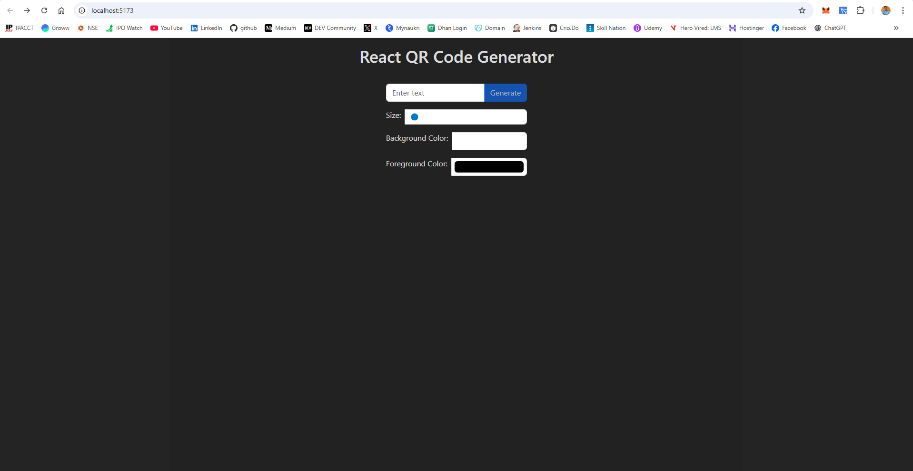
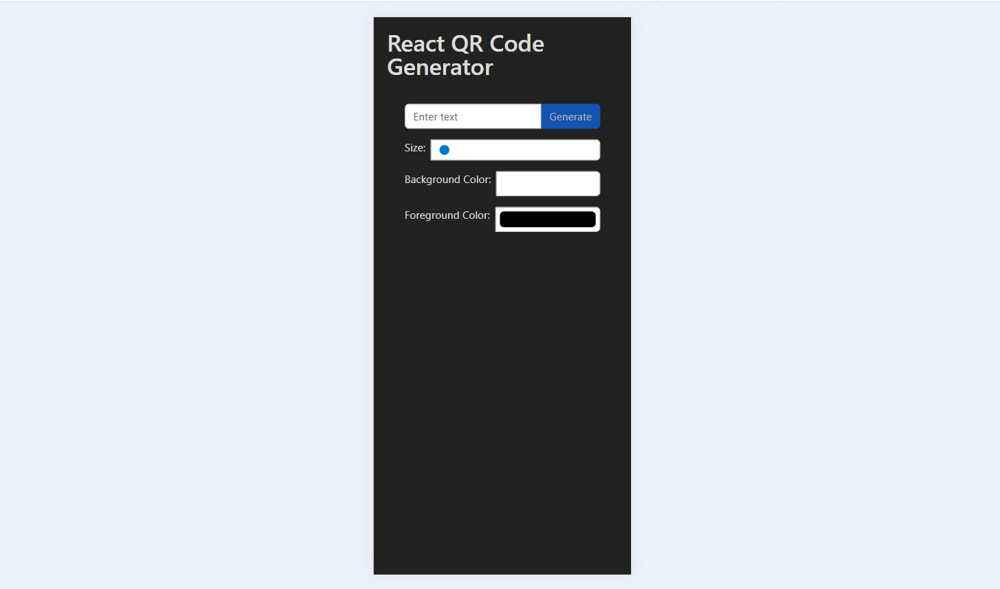

# 🧾 React QR Code Generator App

A responsive, customizable QR code generator built with **React**, **React Bootstrap**, and a public QR code API. Easily generate, preview, and download QR codes based on your input — with live updates, custom colors, and size options.

---

## ✨ Features

- 🔤 Enter any text/URL to generate a QR Code
- 🎨 Choose background and foreground (text) color
- 📐 Adjustable size via slider (200px to 600px)
- ⚡ Live preview (auto-updates on change)
- ⏳ Loading spinner during generation
- 💾 Download QR Code as an image
- ✅ Responsive layout (Bootstrap based)

---

## 🌐 Live Demo

['Live Demo'](https://react-qrcode-olive.vercel.app/)

---

## 🖼️ Preview


> Desktop View


> Mobile View

---

## 🚀 Technologies Used

- [React](https://reactjs.org/)
- [React Bootstrap](https://react-bootstrap.github.io/)
- [QRServer API](https://goqr.me/api/)
- [Bootstrap 5](https://getbootstrap.com/)
- [Spinner](https://react-bootstrap.github.io/components/spinners/)

---

## 📂 Folder Structure

```bash
src/
├── App.jsx
├── App.css
├── main.jsx
└── index.css
```

---

## 🔧 Installation & Usage
```bash

# Clone the repository
git clone https://github.com/surendergupta/react-qrcode.git

# Navigate to the project folder
cd react-qrcode

# Install dependencies
npm install

# Run the app
npm run dev

```

## 📌 How to Use
1. Type or paste your text/URL into the input box.
2. Adjust the size, foreground, or background color.
3. Click the Generate button (or press Enter).
4. Preview and Download the QR code image.

---

## 🔮 Future Improvements
- ✅ Add copy-to-clipboard support
- ✅ Add custom error correction level
- 🔁 Convert to PWA (installable)
- 🌓 Add dark mode toggle
- 📱 Drag-and-drop mobile UI enhancements

---

## 📄 License
This project is open-source under the MIT License.

## 🙋‍♂️ Author
Made with ❤️ by [Surender Gupta](https://linkedin.com/in/surender-gupta)